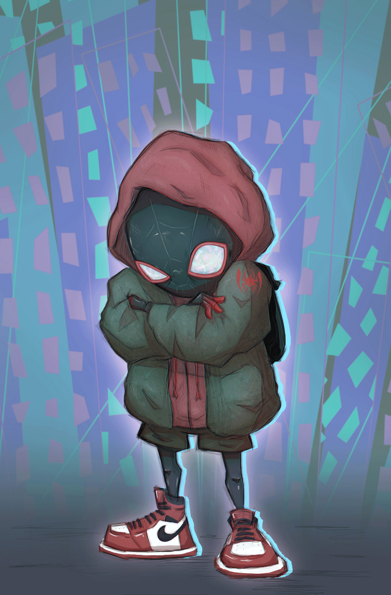
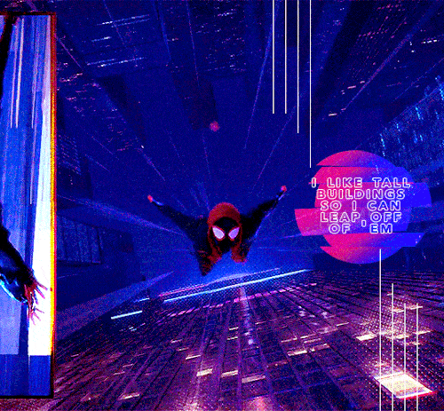
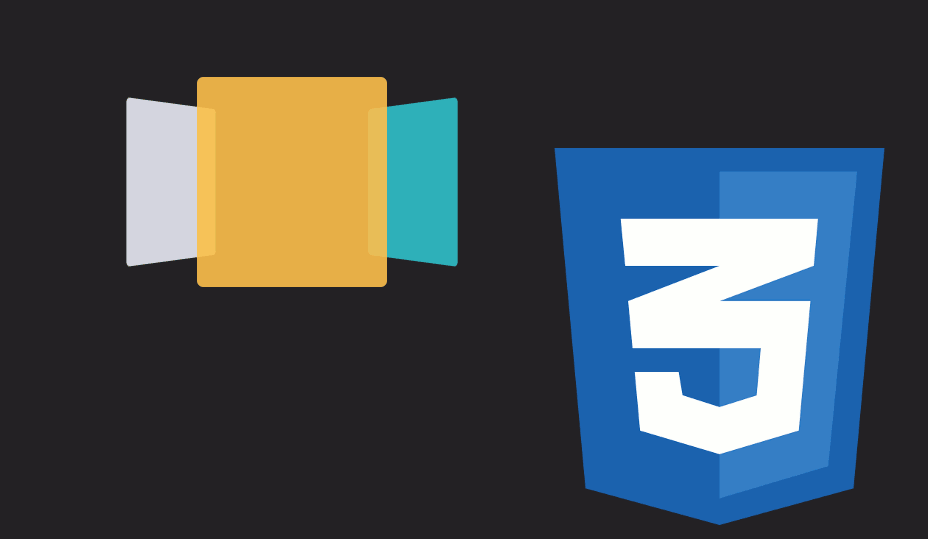
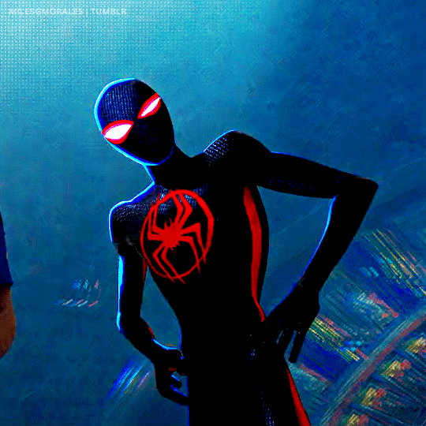

  

    
  

  <h2>
    <picture
      ></picture>
    / About me /
  </h2>

  <ul>
    <li>💻 I'm a Frontend Developer.</li>
    <li>🚀 I'm an Industrial Manager.</li>
    <li>👨‍👩‍👧‍👧 I like working in a team.</li>
    <li>🤘🏽🎸 I like classic rock.</li>
    <li>☕ I love coffee.</li>
  </ul>

  <h2>
    <picture
      ></picture>
    / Current skills /
  </h2>

  

    
    
    
    
  

<h2>
  <picture
    ></picture>
  / How to reach me /
</h2>

    
    
        src="https://img.shields.io/badge/aleroses-black?style=social&logo=linkedin"
        t="linkedin" />
    </a>
    
    
  

