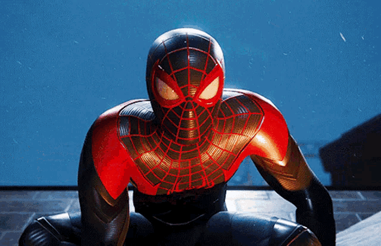

  

    
  

  <h2>
    <picture
      ></picture>
    / About me /
  </h2>

  <ul>
    <li>💻 I'm a Student Programation.</li>
    <li>🚀 I'm a Study in ISTPET.</li>
    <li>👨‍👩‍👧‍👧 I like the tecnology.</li>
    <li>🤘🏽🎸 I like tool music.</li>
  </ul>

  <h2>
    <picture
      ></picture>
    / Current skills /
  </h2>

  

    
    
    
    
  

<h2>
  <picture
    ></picture>
  / How to reach me /
</h2>

    <a
      href=""
      target="_blank">
      
    
      

       
